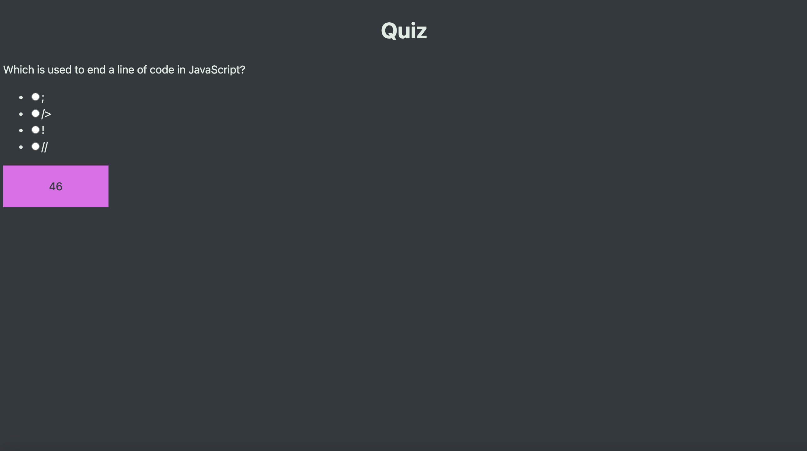

# 04 Web APIs: Code Quiz

## User Story

```
AS A coding boot camp student
I WANT to have a way to practice and study the content I've learned
SO THAT I can keep practicing the things I've learned 
```

## Acceptance Criteria

```
GIVEN I am want to practice taking the coding quiz
WHEN I click the begin button
THEN the first question and set of answers shows up
WHEN I answer a question (if answered incorrectly, 10 seconds is subtracted from the quiz timer)
THEN the next question shows up
WHEN I have run out of time or answered all the question
THEN a textbox appears that allows you to add your name to the leaderboard
WHEN I put my name in the textbox
THEN my name and score is put in the leaderboard along with all local storage scores
```

## Mock-Up


[URL](https://clayandemar.github.io/coding-quiz/)
